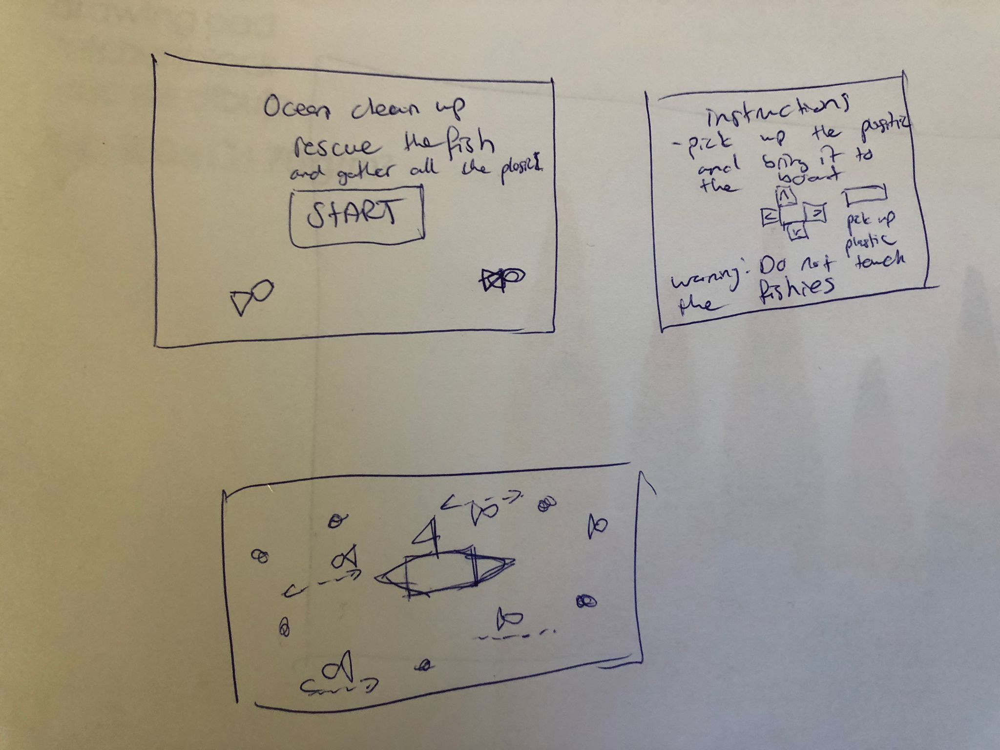

# Ocean-Clean-Up

## Description

Ocean Clean Up is a game where the player has to collect the plastic in the ocean. While cleaning, the player must avoid touching the fish otherwise the fish will die and the game is over. If all the plastic is collected, the player wins the game. After the game ends, the score is calculated based on the amount of platic that is collected. 

## MVP (DOM - CANVAS)

- the game has one player
- game has fish moving horizontally
- the fish appear randomly in different places
- the plastic doesnt move

## Backlog 

- add scoreboard 
- highest score is saved 
- can restart game

## Data Structure 

# main.js 
- buildSplashScreen () {}
- buildGameScreen () {}
- buildGameOverScreen () {}

# fish.js 
- Fish () {this.x, this.y, this.direction}
- move () {}
- draw () {}
- collision() {}

# game.js 
- Game () {}
- drawCanvas() {}
- collision () {}
- clearCanvas() {}
- gameOver () {}

# plastic.js 
- draw() {} 
- score () {}
- remove() {}

## States

- splashScreen 
- gameScreen
- gameOverScreen

## Task 

### main
- buildDom 
- buildSpashScreen 
- addEventListener
- buildGameScreen
- buildGamerOverScreen

### game 
- startLoop
- buildCanvas
- updateCanvas 
- drawCanvas
- checkCollision
- gameover 

### plastic 
- draw
- remove

### fish 
- draw
- move 

### swimmer 
- draw
- move 

## sketches 

